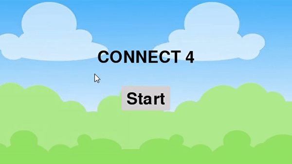

# Connect4 Classic Game played against AI
Game "Connect 4" with Python using Pygame for visualization. The user plays (yellow) against an AI (red). The AI uses _minimax_ algorithm to compute the best next move, with a depth search limit (currently set to 3). Below

